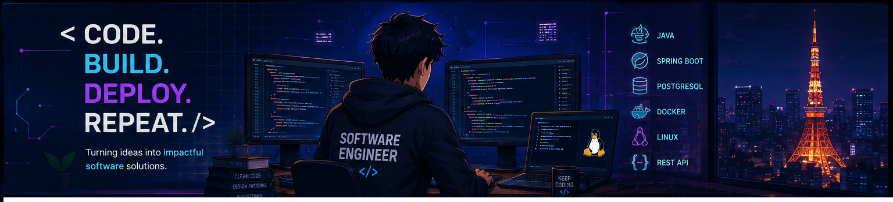

  

  <b>こんにちは、皆さん 👋🏻 </b>

<h1 align="center">
  <b>I'm Dishant Drugkar</b>
</h1>

I’m a **Tech enthusiast** and Aspiring Software Engineer, who’s passionate about developing, automating, and deploying applications. With hands-on experience in Java, Spring Boot, REST APIs, Linux, and Computer Networks. Currently diving deep into JavaScript, React.js, and DevOps Tools to sharpen my skills and contribute to real-world projects.

---

## 🛠️ Tech Stack & Tools

  

---

## 📈 Contribution Overview

  

  

---

## Let’s Connect

  

  

---

  <i>Always learning. Always building. 🚀</i>

